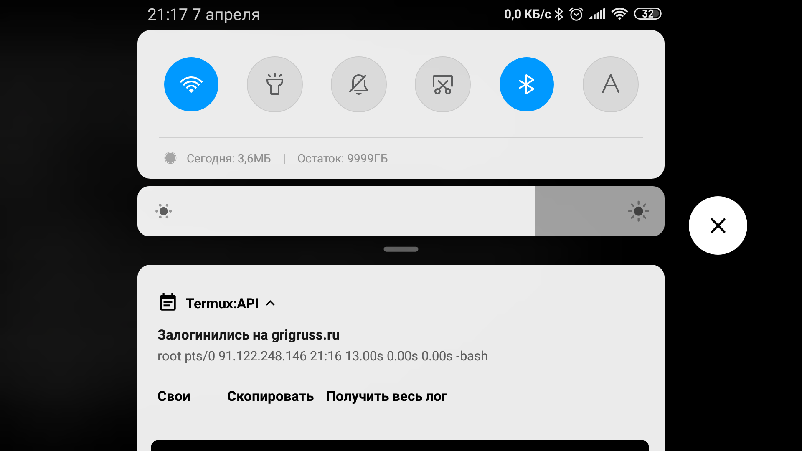

# watch-srv

Скрипт для termux (Android only), следит за указанным сервером. Если кто-то залогинился на сервер, скрипт выдаёт уведомление в телефоне.

### Требования

1. termux, termux-api

2. Разрешения termux и termux-api на домтуп к сети и файлам

3. Возможно ещё что-то... не помню...

### Установка

1. Устанавливаем [termux](https://play.google.com/store/apps/details?id=com.termux)

2. Устанавливаем [termux-api](https://play.google.com/store/apps/details?id=com.termux.api)

3. Заходим в termux, делаем следующее:

```
apt update
apt upgrade
apt install termux-api
```

Это установит обновления, если они имеются, и установит связь termux с termux-api.

4. Устанавливаем git

```
apt install git
```

5. Клонируем watch-srv

```
git clone https://git.tuxnix.ru/nixscript/watch-srv
```

Всё готово к настройке.

**Примечание:** по-умолчанию в termux есть только *vi*,
так что если не дружите с ним, установите предпочтительный.
К примеру я использую **Midnight Commander** ( *mc* ),
в котором есть *mcedit*, но больше мне нравится *micro*.
И *mc*, и *micro* доступны, так что думаю и другие
редакторы тоже есть.

### Настройка

Есть масса вариантов, оставить скрипт в текущем месте,
переместить в системную директорию, например /usr, или
сделать наиболее логично. Создать директорию ~/bin и
скопировать скрипт туда. На примере ~/bin я и опишу
настройку.

1. Создаём директорию

```
mkdir ~/bin
```

2. Копируем туда скрипт

```
cp ./watch-srv/watch-srv.sh ~/bin/watch-srv.sh
```

3. Открываем скриптс любимым редактором, раскомментируем
последнюю строку и заменяем в ней *login* *server.ru* и
*22* на нужные параметры.

```
check "login" "server.ru" 22
```

4. Добавляем задачу в *cron*. Помните, редактор
по-умолчанию - *vi*. Если хотите использовать другой,
вот вам пример:

```
export EDITOR="mcedit"; crontab -e

# или так

export EDITOR="micro"; crontab -e
```

Задачу в *cron* добавить легко. К примеру для проверки
каждую минуту в редакторе пишем такую строку:

```
* * * * * ~/bin/watch-srv.sh
```

Я решил сделать проверку каждые 30 секунд, поэтому
пришлось использовать hack:

```
* * * * * ~/bin/watch-srv.sh
* * * * * (sleep 30; ~/bin/watch-srv.sh)
```

Здесл два вызова скрипта, оба действуют через минуту,
но первый сразу срабатывает, а другой с задержкой в
30 секунд.

Сохраняем и выходим.

5. Осталось лишь запустить *cron*

```
crond
```

Теперь, если кто-то залогинится на сервере, в
телефоне появится уведомление такого вида:



Как видно на скриншоте, имеется три кнопки:

1. Свои - предотвращает постоянное появление
уведомление до тех пор, пока на сервере не
разлогинится пользователь. После выхода всех
пользователей скрипт отрабатывает в стандартном
режиме.

2. Скопировать - помещает текст уведомления в
ситемный буфер обмена смартфона.

3. Получить весь лог - получает весь лог и
сохраняет его в Downloads/srv-login.log

### Заключение

Всё достаточно просто. Если есть пожелания,
предложения, идеи, пишите в [ВК/Nixscript](https://vk.com/nixscript)
или мне [VK/grigruss](https://vk.com/grigruss).
